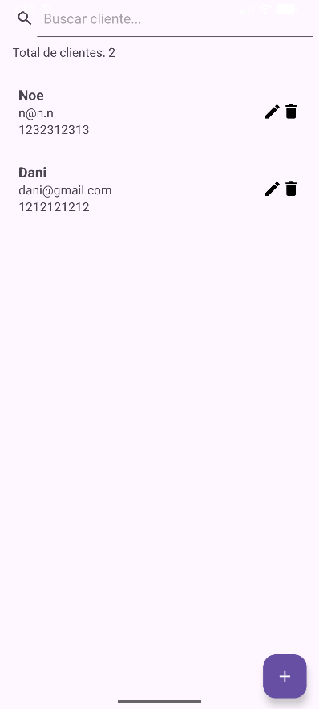
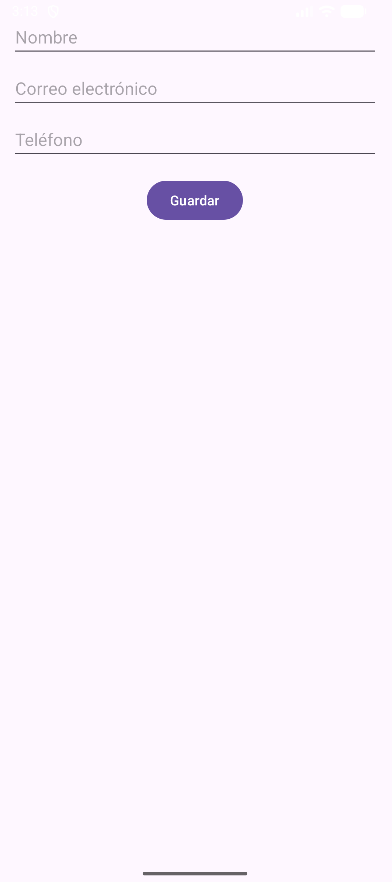
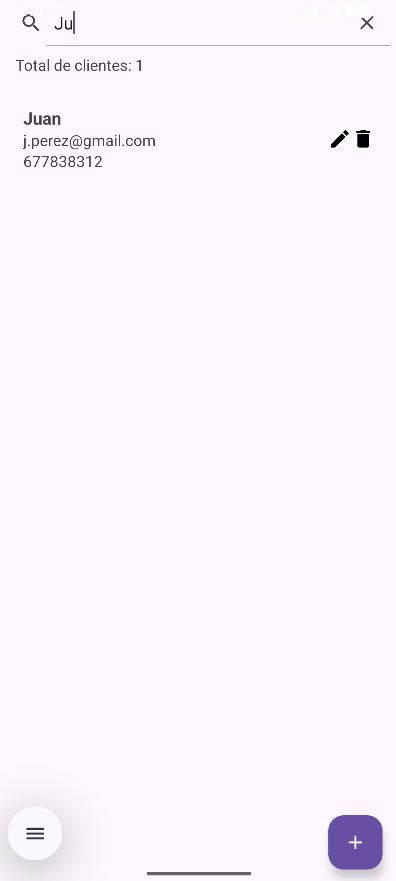
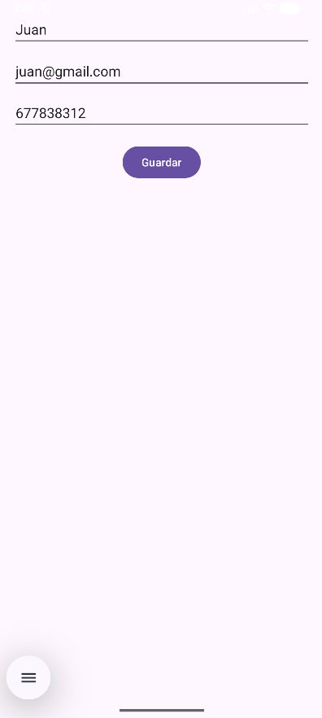
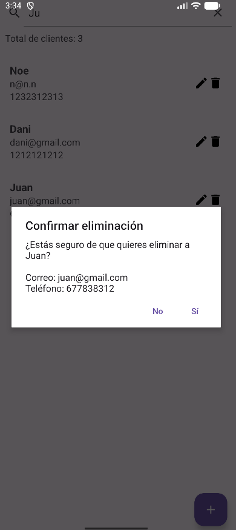

# Act1_2 - Gestor de Clientes

Esta es una sencilla aplicación de Android para gestionar una lista de clientes. Permite añadir, ver, buscar, editar y eliminar clientes. Los datos se guardan en una base de datos SQLite local.

## Instrucciones para abrir y ejecutar el proyecto

1.  **Descargar el proyecto**: Descarga el archivo ZIP del proyecto y descomprímelo en una carpeta de tu ordenador.
2.  **Abrir en Android Studio**: 
    *   Abre Android Studio.
    *   Selecciona "File" > "Open" (o "Open an existing project" en la pantalla de bienvenida).
    *   Navega hasta la carpeta donde has descomprimido el proyecto y selecciónala.
    *   Android Studio se encargará de sincronizar el proyecto con Gradle. Este proceso puede tardar unos minutos.
3.  **Ejecutar la aplicación**:
    *   Una vez que el proyecto se haya sincronizado, asegúrate de que tienes un emulador configurado o un dispositivo físico conectado.
    *   Pulsa el botón "Run" (el icono del triángulo verde) en la barra de herramientas superior.
    *   La aplicación se instalará y se ejecutará en el emulador o dispositivo seleccionado.

## Capturas de pantalla funcionales

Aquí puedes ver cómo funciona la aplicación en sus diferentes pantallas.

### Pantalla de inicio

Aquí vemos como es la pantalla de inicio de la aplicación.

### Creando un contacto

Aquí vemos como tras pulsar en el botón de más en la esquina inferior derecha. Nos lleva a una nueva página donde tendremos que ingresar el nombre, correo electrónico válido y el número de teléfono.

### Buscando un contacto

Aquí vemos como buscamos "Ju" y nos muestra el nuevo contacto creado Juan, y no nos muestran los demás usuarios.

### Editando un contacto

Si nos hems equivocado en la información de algun cliente podemos pulsar el icono del lápiz y editarlo, nos llevará a la página como la de crear un cliente nuevo, y simplemente cambiarlo.

### Eliminando un contacto

Si deseamos eliminar a un cliente, simplemente pulsamos en el botón de la papelera, y nos mostrará una ventana de confirmación. Si confirmamos, se eliminará permanentemente.

## Breve explicación del modelo de datos

El modelo de datos de la aplicación se centra en una única entidad: el **Cliente**. Para gestionar la persistencia de los datos, se ha utilizado una base de datos SQLite. A continuación, se detalla la estructura:

### Clase de datos `Cliente`

Se ha definido una clase de datos (`data class`) en Kotlin llamada `Cliente`. Esta clase es `Parcelable`, lo que permite pasarla fácilmente entre las diferentes `Activities` de la aplicación.

La clase `Cliente` tiene los siguientes campos:

*   `id`: `Long` - Identificador único para cada cliente. Es la clave primaria en la base de datos.
*   `nombre`: `String` - Nombre del cliente.
*   `correo`: `String` - Dirección de correo electrónico del cliente.
*   `telefono`: `String` - Número de teléfono del cliente.

### Base de datos SQLite

Se ha utilizado `SQLiteOpenHelper` para crear y gestionar la base de datos. La base de datos, llamada `Clientes.db`, contiene una única tabla (`clientes`) con la siguiente estructura:

*   `_id`: `INTEGER` (Clave primaria autoincremental)
*   `nombre`: `TEXT`
*   `correo`: `TEXT`
*   `telefono`: `TEXT`

Para organizar el código y separar la lógica de la base de datos de la interfaz de usuario, se han creado dos clases adicionales:

*   `ClienteDbHelper`: Se encarga de la creación y actualización de la base de datos.
*   `ClienteDataSource`: Actúa como intermediario entre la aplicación y la base de datos. Contiene todos los métodos para leer, añadir, actualizar y eliminar clientes (operaciones CRUD).
